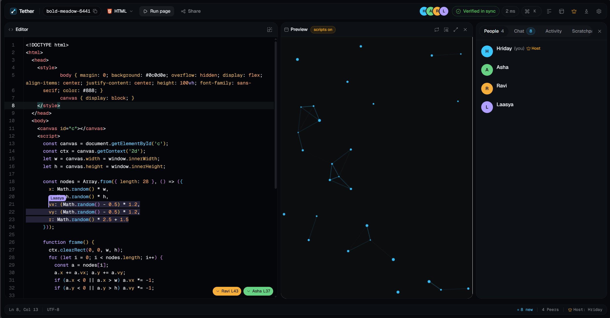
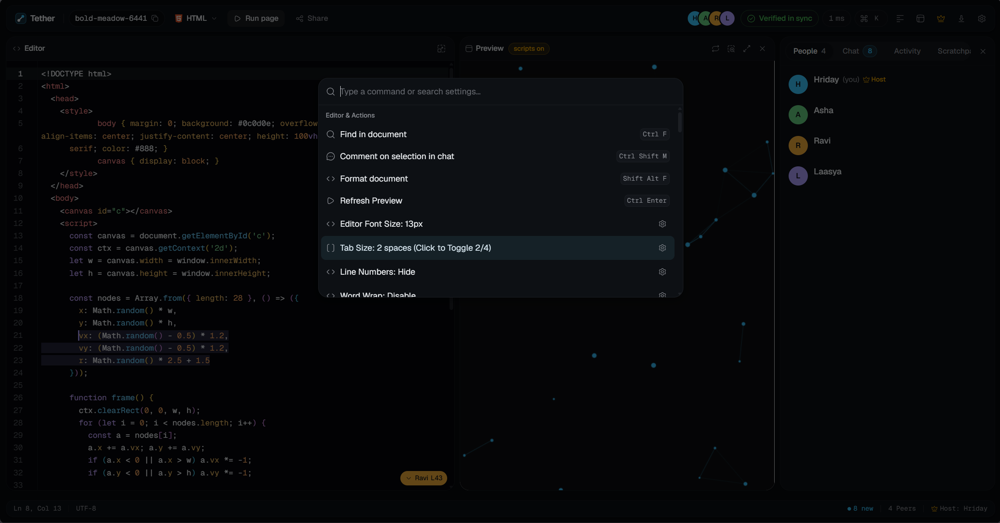
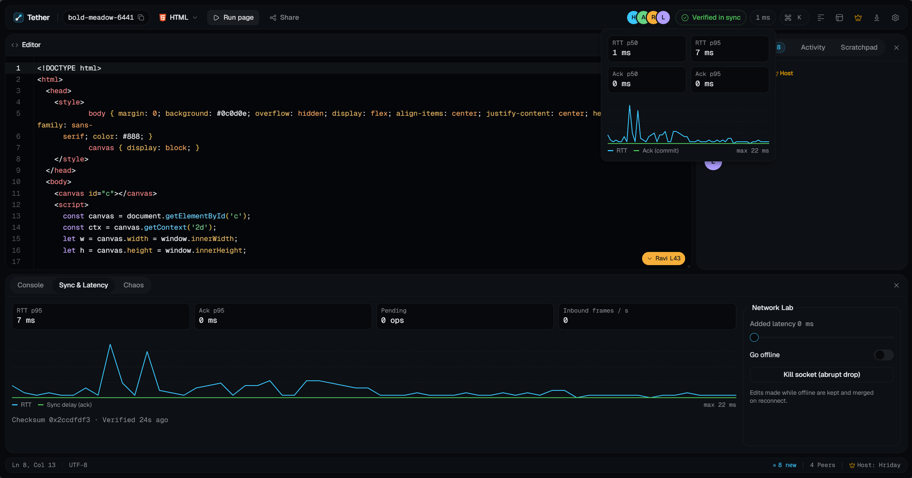

# Tether

[](https://nodejs.org/)
[](https://pnpm.io/)
[](https://www.typescriptlang.org/)
[](https://nextjs.org/)
[](https://fastify.dev/)
[](https://yjs.dev/)
[](LICENSE)

A real-time collaborative code editor built on Yjs CRDTs, a Fastify WebSocket sync server, CodeMirror 6, and Next.js 16.



## Features

- **Real-time collaboration**: Peers can edit together. Yjs merges concurrent edits, and rate-limited broadcasts combine pending updates instead of dropping them.
- **Sync verification**: When editing pauses, clients compare document checksums with the server. The interface shows when they match, and a mismatch triggers automatic recovery.
- **Latency and sync status**: View round-trip and peer-delivery latency, including p50 and p95 measurements. The status indicators show whether edits are pending, syncing, or saved.
- **Network Lab and bot storms**: Use the diagnostics drawer to add latency, take the client offline, or drop its socket. Hosts can configure bot storms, review convergence, and restore the document afterward.
- **Presence and host controls**: See collaborators' cursors, selections, and activity. Hosts can lock rooms, rotate passcodes, remove participants, and change the room's syntax mode.
- **Room chat with code quotes**: Quote a selected code snippet in chat with `Ctrl/Cmd+Shift+M`. The reference follows the code as it changes.
- **Sandboxed execution and console**: Preview HTML, CSS, and JavaScript in an isolated iframe. Run JavaScript and TypeScript in a Web Worker with a 5-second watchdog. The console captures logs, warnings, errors, and results.
- **Themes**: Choose Quiet Dark, Quiet Light, or High Contrast, and preview theme changes before switching.
- **Command palette**: Press `Ctrl/Cmd+K` to search navigation, room and host actions, editor settings, and themes.
- **Storage and room cleanup**: Data is stored in SQLite (single server instance). Inactive temporary rooms are deleted after 24 hours.

### Keyboard Shortcuts

| Shortcut | Action |
| --- | --- |
| `Ctrl/Cmd + K` | Open Command Palette (navigation, actions, editor settings, themes) |
| `Ctrl/Cmd + ?` (or `?`) | View keyboard shortcuts modal |
| `Ctrl/Cmd + ,` | Open Settings modal |
| `Ctrl/Cmd + Enter` | Run code in sandboxed worker / refresh preview |
| `Shift + Alt + F` | Format document |
| `Ctrl/Cmd + Shift + F` / `F11` | Toggle Zen mode (distraction-free editor & preview) |
| `Ctrl/Cmd + B` | Toggle sidebar (People / Chat / Activity / Scratchpad) |
| `Ctrl/Cmd + J` (or `Ctrl + \``) | Toggle bottom diagnostics drawer & console |
| `Ctrl/Cmd + Shift + M` | Quote selected code snippet into room chat |
| `Alt + H` | Highlight current line for all peers |
| `Ctrl/Cmd + F` | Find in document |

### Command Palette

Press `Ctrl/Cmd + K` to open the Command Palette for keyboard-driven navigation, editor settings, and room controls:



### Diagnostics Drawer & Network Lab

Expand the bottom drawer to inspect real-time RTT latency, verify SHA-256 state checksums, or simulate network chaos (inject latency, drop sockets, and trigger bot storms):



## Architecture

```
                       ┌─────────────────────────────────────────┐
                       │               Web Browser               │
                       │    Next.js 16 Client (localhost:3001)   │
                       └─────────────┬─────────────┬─────────────┘
                                     │             │
                             HTTP API│             │WebSocket Sync
                          (Port 4000)│             │(Port 4000)
                                     ▼             ▼
                       ┌─────────────────────────────────────────┐
                       │          @tether/server (:4000)         │
                       │   Fastify 5 REST + WebSocket Engine     │
                       │   Yjs CRDT Sync + Host Election         │
                       └─────────────┬─────────────┬─────────────┘
                                     │             │
                                     ▼
                              ┌──────────────────┐
                              │  Embedded SQLite │
                              │ ./data/tether.db │
                              └──────────────────┘
```

| Path                   | Package               | Description                                                                        | Dev port |
| ---------------------- | --------------------- | ---------------------------------------------------------------------------------- | -------- |
| `apps/server`          | `@tether/server`      | REST API, WebSocket server, Yjs sync, room persistence (Fastify 5, ws, Yjs)        | 4000     |
| `apps/web`             | `@tether/web`         | Editor, console, room management (Next.js 16, React 19, CodeMirror 6, Tailwind v4) | 3001*    |
| `packages/shared`      | `@tether/shared`      | Protocol codecs, Zod schemas, rate limiter, backoff, checksums                     | —        |
| `packages/sync-client` | `@tether/sync-client` | Client-side WebSocket sync driver                                                  | —        |
| `tests/chaos`          | `@tether/chaos`       | Network chaos, convergence, and invariant tests (Vitest, fast-check)               | —        |

\* _Note: Local development runs Next.js on port `3001` to prevent collisions with standard local services on port `3000`. Docker Compose maps the web container to port `3000`._

## Getting started

### Prerequisites

- **Node.js**: `22+` (required for native `node:sqlite`)
- **pnpm**: `9+`
- **Git**

### 1. Setup

You can set up Tether with the interactive wizard script or with manual commands.

#### Option A: Automated setup wizard

The setup script creates `.env` with a secure random `JWT_SECRET`, installs workspace dependencies, builds shared packages, and initializes `./data`. Every prompt provides a recommended default, so pressing Enter throughout configures a local SQLite setup.

Windows:

```powershell
.\setup.ps1
```

Linux / macOS / WSL / Git Bash:

```bash
chmod +x ./setup.sh ./launch.sh
./setup.sh
```

The script asks for:

1. **Environment**: local (Node + pnpm), Docker Compose, or both.
2. **Ports**: backend (default 4000) and web (default 3001). Related `.env` values are updated to match.
4. **Launch**: whether to start dev servers when setup finishes.

For scripted or CI environments without prompts:

```powershell
# Windows
.\setup.ps1 -NonInteractive
```

```bash
# POSIX
./setup.sh --non-interactive
```

To target a remote backend, pass `-BackendUrl https://api.example.com` (or `--backend-url=https://api.example.com`), then rebuild the web app since `NEXT_PUBLIC_*` values are fixed at build time.

#### Option B: Manual setup

If your environment restricts running scripts or you prefer explicit commands:

```bash
# 1. Copy environment template
cp .env.example .env

# 2. Ensure data directory exists for SQLite
mkdir -p data

# 3. Install dependencies across workspaces
pnpm install

# 4. Build shared packages (required before web/server can compile)
pnpm build:pkg
```

### 2. Run

Start both servers concurrently:

```bash
./launch.sh      # or .\launch.ps1 on Windows, or pnpm dev
```

- Web client: http://localhost:3001
- HTTP API: http://localhost:4000
- WebSocket sync: `ws://localhost:4000`
- Readiness check: http://localhost:4000/health/ready
- OpenAPI spec: http://localhost:4000/docs/openapi.json

## Docker

Run the stack via Docker Compose:

```bash
docker compose up -d                      # web + server + SQLite volume
```

In Docker, the web client runs on http://localhost:3000 and the API on http://localhost:4000.

## Configuration

See `.env.example` for all options. The server stores everything in SQLite:

```env
DATABASE_DRIVER=sqlite   # the only supported value
SQLITE_PATH=./data/tether.db
```

PostgreSQL is not supported. Running several server instances would need an async repository layer and room affinity first; see [docs/09 › Scale path](docs/09-operations.md#scale-path-documented-not-built-in-v1).

## Benchmarks

From `pnpm bench`, 5 concurrent clients on localhost:

| Scenario                             | Samples | Min     | p50     | p95       | p99       | Max       | Mean     |
| ------------------------------------ | ------- | ------- | ------- | --------- | --------- | --------- | -------- |
| Isolated edits (1 edit/s per client) | 200     | 0.67 ms | 1.60 ms | 6.27 ms   | 13.06 ms  | 13.26 ms  | 2.50 ms  |
| Burst typing (15 chars/s per client) | 500     | 1.41 ms | 8.33 ms | 124.26 ms | 142.71 ms | 143.31 ms | 37.46 ms |

Burst latency is bounded by the 200 ms batching window and the token-bucket throttle.

## Scripts

> [!NOTE]
> Whenever you modify `@tether/shared` or `@tether/sync-client`, run `pnpm build:pkg` so dependent workspaces receive updated TypeScript type definitions.

```bash
pnpm dev          # server + web (concurrent)
pnpm dev:server   # backend only (port 4000)
pnpm dev:web      # frontend only (port 3001)
pnpm db:migrate   # run sqlite database migrations
pnpm test         # all unit and integration tests
pnpm chaos:ci     # network partition and convergence tests
pnpm bench        # latency benchmark
pnpm typecheck    # workspace-wide typechecking
pnpm lint         # workspace-wide linting
pnpm build:pkg    # compile @tether/shared and @tether/sync-client
pnpm build        # typecheck, test, and build shared packages
```

## Documentation

- [Product brief](docs/01-product-brief.md)
- [Architecture](docs/02-architecture.md)
- [Sync engine](docs/03-sync-engine.md)
- [Wire protocol](docs/04-protocol.md)
- [Rooms, security, and host handover](docs/05-rooms-security-roles.md)
- [Data model](docs/06-data-model.md)
- [Frontend](docs/07-frontend.md)
- [Testing and benchmarks](docs/08-testing-and-verification.md)
- [Operations](docs/09-operations.md)
- [Roadmap](docs/10-roadmap.md)
- [Architecture decisions (ADRs)](docs/11-decisions.md)
- [UI / UX](docs/12-ui-ux.md)
- [OpenAPI specification](docs/openapi.json)

## Contributing

Contributions are welcome! Please read [CONTRIBUTING.md](CONTRIBUTING.md) and our [Code of Conduct](CODE_OF_CONDUCT.md) before submitting pull requests.

## Security

For security vulnerability reports, please review our [Security Policy](SECURITY.md) and report responsibly to [hridaysingh2207@gmail.com](mailto:hridaysingh2207@gmail.com).

## License

[MIT](LICENSE) © 2026 Hriday Singh
