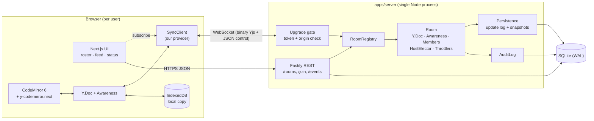
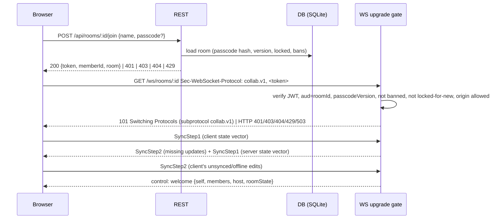

# 02: Architecture

## System overview



## Stack

| Layer | Choice | Why |
|-------|--------|-----|
| Monorepo | pnpm workspaces | Shared protocol code between web, server and test harness |
| Web | Next.js (App Router, TypeScript strict) | User default stack. Workspace page is a client component; editor loaded with `dynamic(..., { ssr: false })` |
| Editor | CodeMirror 6 + `y-codemirror.next` | Light, mobile friendly, stable Yjs binding with remote cursors/selections and per-user undo |
| CRDT | `yjs` **v13** + `y-protocols` + `lib0` | v14 (`@y/y`) binding is unstable per upstream README, so we pin v13 |
| Server | Node 24 LTS, Fastify (REST) + `ws` (`noServer: true`) on the same HTTP server | Manual `upgrade` handling lets us authenticate **before** the handshake completes |
| Validation | Zod schemas in `packages/shared` | One schema for REST bodies, control messages and env |
| DB | SQLite (`node:sqlite`, WAL mode) only ([ADR-020](11-decisions.md#adr-020-sqlite-only-postgres-removed)) | Zero external dependencies for dev/testing, in-memory option for sub-second test runs. Postgres would need an async repo layer first ([09](09-operations.md#scale-path-documented-not-built-in-v1)) |
| Auth | HS256 JWT room session token (`jose`) | Stateless verification at upgrade; see [05](05-rooms-security-roles.md) |
| Passcode hashing | Node `crypto.scrypt` + `timingSafeEqual` | Stdlib, no native dependency |
| Client state | TanStack Query (REST) + React Context (session/provider) | User default. Yjs owns editor/presence state, React only subscribes |
| UI kit | Radix primitives + Tailwind v4 with CSS-variable tokens (shadcn pattern) | User default design system rules |
| Metrics | `prom-client` at `/metrics` | Standard, tiny |
| Logs | pino (bundled with Fastify), JSON, token/passcode redaction | Structured logging |
| Tests | Vitest (+ React Testing Library), `fast-check` for property tests | See [08](08-testing-and-verification.md) |

Versions get pinned at scaffold time from current docs (Context7), except Yjs, which stays on v13.

## Repo layout

```
apps/
  web/                     Next.js app
    app/                   routes: /, /r/[roomId]
    components/ui/         Radix-based primitives (Button, Dialog, Popover, Tabs, Toast, Tooltip, Badge...)
    components/workspace/  Editor, Roster, ActivityFeed, StatusPill, LatencyHud, NetworkLab, HostMenu
    lib/                   api client, session context, hooks (useRoster, useConnection...)
    styles/globals.css     THE token file (colors, type, spacing, radius, shadow, motion, presence palette)
  server/
    src/http/              Fastify routes (thin: parse → service → respond)
    src/ws/                upgrade gate, connection handler, frame dispatch
    src/rooms/             Room, RoomRegistry, HostElector, MemberSet
    src/sync/              OutboundThrottle, FloodGuard, awareness binding
    src/services/          RoomService, JoinService, AuditService (business logic)
    src/repo/              SQL data access (rooms, updates, members, events)
    src/config.ts          Zod-validated env
packages/
  shared/                  protocol codec, control message schemas, constants, token bucket, types
  sync-client/             SyncClient provider: framework-agnostic, runs in browser AND Node (chaos tests)
migrations/                0001_init.sql ... (generated, applied by the user)
tests/chaos/               chaos harness + latency bench (Node, uses sync-client against real server)
docs/
```

**Why `sync-client` is its own package:** the chaos harness must drive the exact same provider code that
ships to browsers. If the test used a different client, a passing suite would prove nothing.

## Unit boundaries

| Unit | Does | Depends on | Pure? |
|------|------|------------|-------|
| `shared/protocol` | Encode/decode frames, Zod control schemas | lib0, zod | Yes |
| `shared/tokenBucket` | `take(now)`, `nextAvailableAt(now)` | nothing | Yes (injected clock) |
| `server/HostElector` | Given members + events, decide host | nothing | Yes (injected clock) |
| `server/OutboundThrottle` | Queue/merge per-source updates, flush on tokens | tokenBucket, yjs | Yes (injected clock + send fn) |
| `server/Room` | Owns Y.Doc, Awareness, members, wiring | the above + repo | No |
| `server/Persistence` | Debounced append of updates, compaction | repo | No |
| `sync-client/SyncClient` | Connect, handshake, batch, reconnect, heartbeat, stats | shared, yjs, `WebSocket` impl injected | No |

Pure units carry most of the logic and get the dense unit tests. Clocks are injected everywhere, so
tests run in fake time instead of sleeping.

## Request flows

### Create / join



### Edit

1. User types. CodeMirror dispatches, y-codemirror applies the change to `Y.Text` (local, 0 ms).
2. `SyncClient` receives the `update` event and queues it. Leading edge: if nothing was sent in the
   last 200 ms, flush now; else merge into the pending batch and flush at the window end.
3. Server receives the frame, charges the inbound flood guard, applies it to the room `Y.Doc` right
   away (so new joiners always get the latest state), appends it to the persistence buffer, and hands
   it to the source's `OutboundThrottle`.
4. `OutboundThrottle` broadcasts to all other connections now if a token is available, else merges into
   the pending buffer and flushes when the next token arrives.
5. Peers apply the update; CodeMirror renders only the changed range.

## Concurrency model

Node runs single-threaded, so each room's state (doc, awareness, members, host) is mutated only inside
event-loop callbacks and never needs locks. Every room mutation happens synchronously within one
message handler. The only async boundaries are DB writes, and those never gate the in-memory apply.
Persistence failure is handled separately (see [03](03-sync-engine.md#5-persistence)).

## Open questions

- None blocking.
